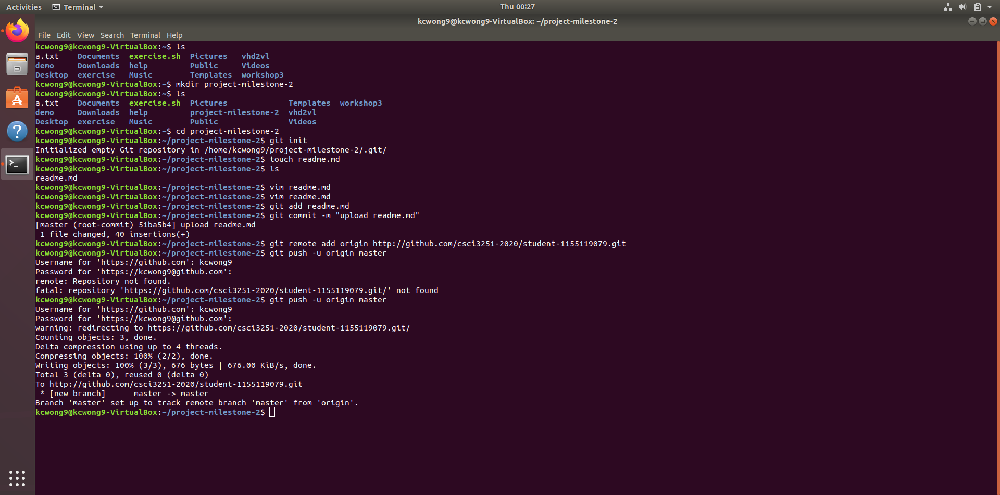

## Developer Infomation

Hello everyone, I am Wong Kin Chung, Matthew.
I am a year 2 CE student.
I love Programming.

## Programming language:

- C,C++
- Java
- VHDL
- Python (Still learning)

## Course taken this semester:
|   Code   |                  Name                    | Credits |
|----------|------------------------------------------|---------|
| CENG3410 | Smart Hardware Design                    |    3    |
| CENG3430 | Rapid Prototyping of Digital Systems     |    3    |
| CSCI3250 | Computers and Society                    |    2    |
| CSCI3251 | Engineering Practicum                    |    1    |
| ELTU3014 | English for Engineering Students II      |    3    |
| ENGG1120 | Linear Algebra for Engineers             |    3    |
| ENGG2430 | Probability and Statistics for Engineers |    3    |

## Workshop accomplished:

- [x] Workshop 1
- [x] Workshop 2
- [x] Workshop 3
- [x] Workshop 4
- [x] Workshop 5

## Screenshot:

 
